# Wordle Solver

[](https://www.python.org)

**Solve Wordle puzzles with different algorithms, visualized in console or with MatPlotLib.**

## Description

A Wordle solver that allows users to test multiple algorithms either in real-time, or against a built-in dataset.

*   **Pre-defined:**  Runs the solver against a set of chosen target words from the dictionary based on word probability. This mode is useful for testing the performance of different algorithms and visualizes the results using a graph via MatPlotLib, it shows the distribution of attempts and success rates.
*   **Real-time:** Allows you to play Wordle interactively with the solver's assistance. You provide feedback on the solver's guesses, and the solver adapts its strategy in real-time to find the solution.

The program includes the following Wordle solving algorithms:

*   **Random:** A baseline algorithm that randomly guesses words from the dictionary. It doesn't use any feedback from previous guesses.
*   **Random Filtered:**  A more sophisticated random algorithm that filters the word list based on feedback from previous guesses (gray, yellow, green hints) to narrow down the possibilities.
*   **Entropy:**  An information theory-based algorithm that aims to maximize information gain with each guess. It calculates the entropy of possible guesses to select the word that is most likely to reduce the search space effectively.

## Getting Started

### Prerequisites

Before running the Wordle Solver, ensure you have the following installed:

*   **Python 3.7 or higher:**  You can download Python from [python.org](https://www.python.org).
*   **Libraries:** Install the necessary Python libraries using pip:

    ```bash
    pip install matplotlib numpy wordfreq
    ```

### Installation

1.  **Clone the repository (or download directly):**

    ```bash
    git clone https://github.com/a22Dv/wordle-solver
    cd wordle-solver
    ```


### Running the Program

To run the Wordle Solver, just extract the `.zip` file under the `Releases` section. Click and run `Wordle Solver.exe`.

## Directions


* The program takes some time to load, but you should be greeted by this option upon startup:

    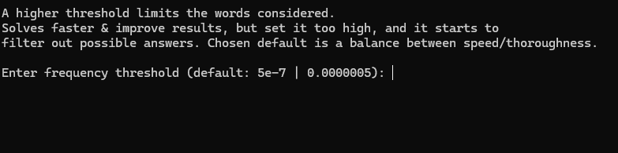

    This frequency threshold limits the amount of words to be considered from the original `~15000` to around `~3000` at default setting. You should generally just leave it alone and press Enter. It is not enforced, but the maximum possible frequency threshold you can set without breaking it is `1e-3`, at which point only 10 words are being considered. Set it to `0` to include all `~15000` words. 
* After pressing Enter, you'll see these options. Just select the algorithm you'd like to use out of the 3 options. They are ordered from fastest => slowest, weakest => strongest. 

    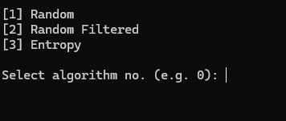

* After that, select either pre-defined, to test the algorithm on a selected part of its data-set, or real-time if you'd like to use the algorithm on the fly / while playing a game.

    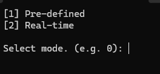

### Pre-defined

* This sets the interval for how many `ms` it takes between the updates. Set it higher to update the graph slower, and vice-versa.

    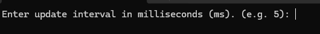

* The `test-case size` is the amount of times you'd like the algorithm to run. Note that this is limited by the frequency you've set earlier. A size higher than the considered word list is rejected. So you should input a lower number if that's the case.

    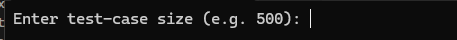

* `Random` - Pure random.
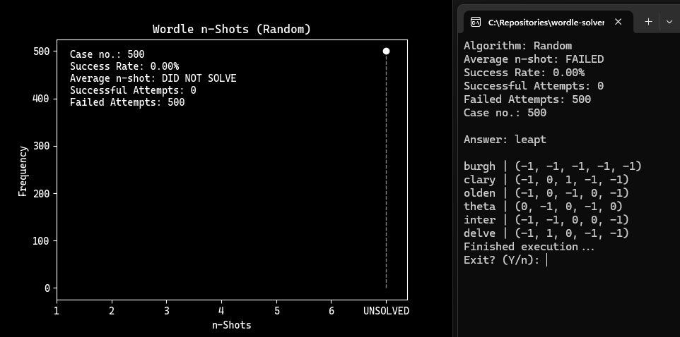
* `Random Filtered` - Random, but incorporates feedback gained from the puzzle. 
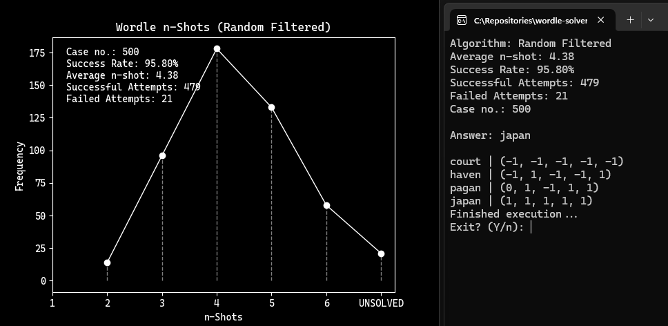
* `Entropy` - Uses information theory and "entropy" to determine the guess that would minimize the entropy the most, maximizing the `bits` of information gained per guess.
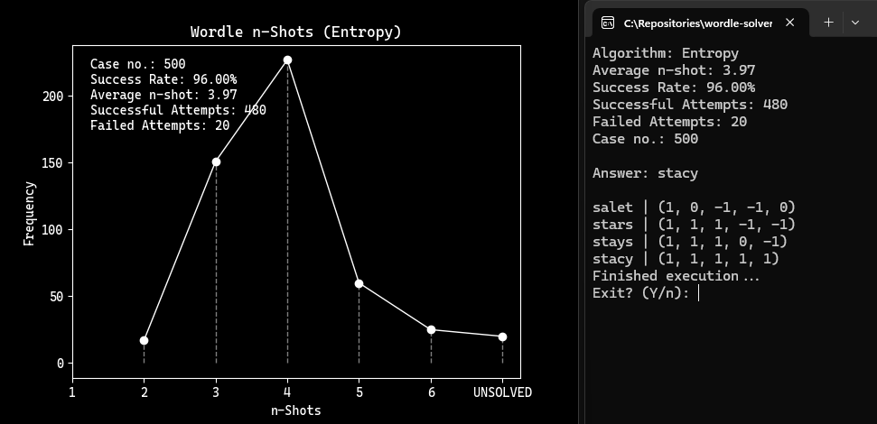

### Real-time
*  Depending on your initial algorithm, you'll be shown a list of 10 or 20 possible answers.
    - `(Random/Random Filtered)`: The ones with % indicate the probability of that word occuring. 
    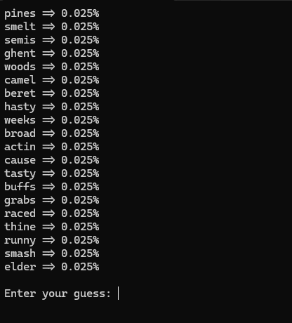
    - `(Entropy)`: Those with B's indicate the `bits` of information you gain after that guess. 
    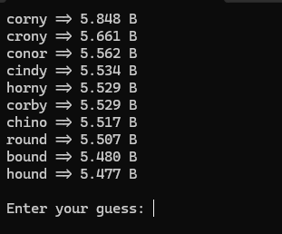
    
* Just pick a guess, type in the guess you've chosen and press Enter.

* You will then be asked to enter the feedback of the move as it is in the Wordle game. Just follow the guidelines provided and separate them with a single `space`.
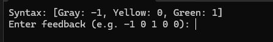

* Repeat until the algorithm either solves/fails the puzzle.


